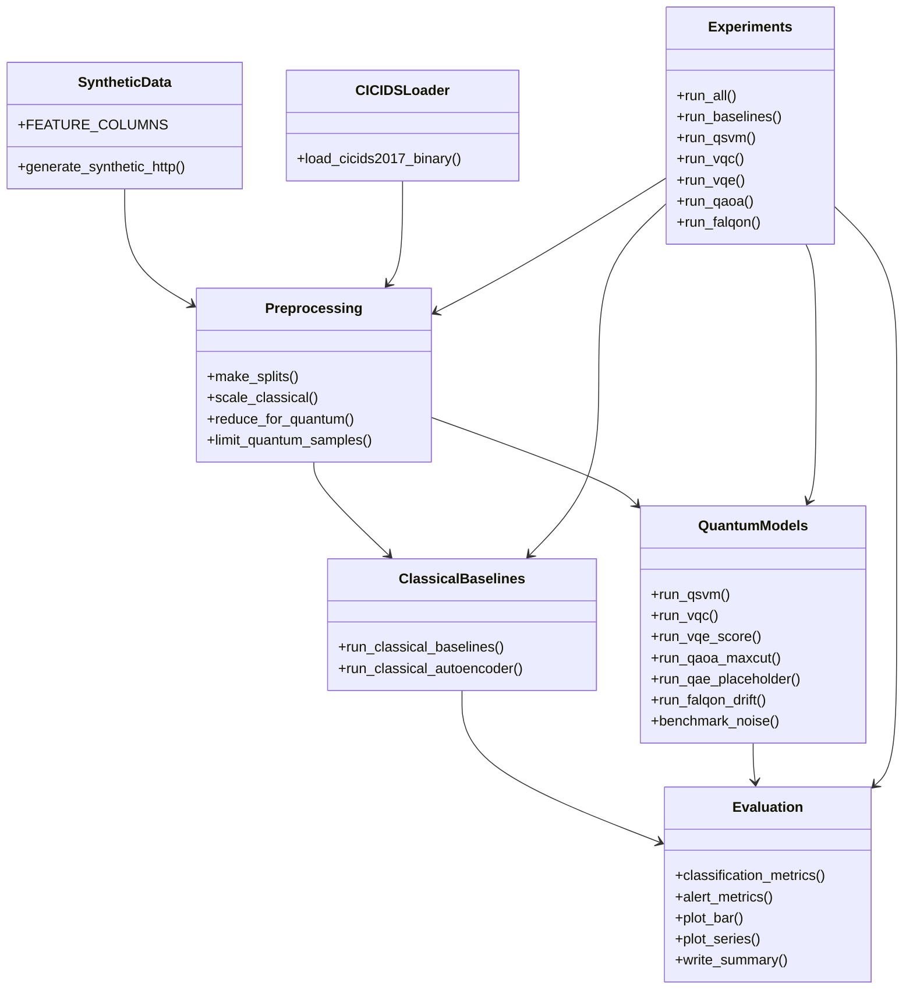
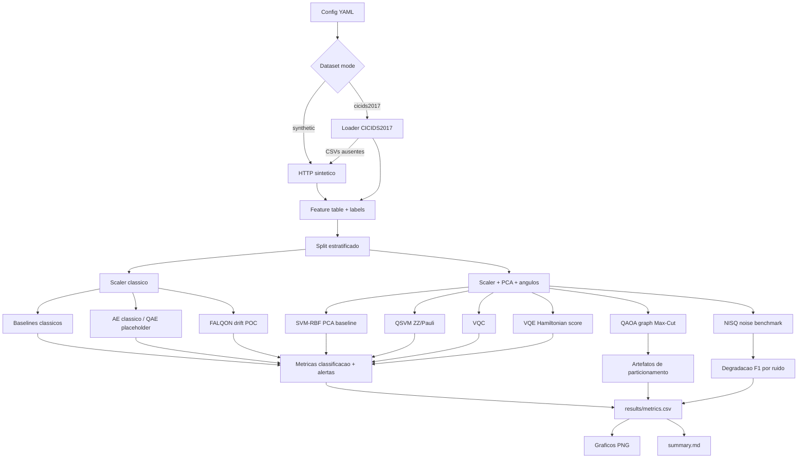

# Revisao pre-merge AnomaliQ v3

Data da revisao: 2026-06-16

Escopo: revisao local do repositorio AnomaliQ-v3 apos a implementacao da suite experimental reprodutivel para DDoS com modelos classicos, QML e POCs hibridas NISQ. Esta revisao nao altera codigo; documenta aderencia, riscos e proximas acoes.

## Sumario executivo

A implementacao atende ao objetivo central de disponibilizar uma suite modular executavel por `python -m src.experiments.*`, com configuracao YAML, resultados em CSV/Markdown e graficos em PNG. A execucao sintetica mais recente gerou `results/metrics.csv`, `results/summary.md`, artefatos de QAOA/FALQON/NISQ e nao produziu `results/failures.csv`.

O repositorio ainda nao esta pronto para merge sem ressalvas se o criterio incluir manutencao de longo prazo e reprodutibilidade cientifica forte. Os principais bloqueios sao: coexistencia de modulos legados quebrados em `src/`, notebook antigo apontando para esses modulos, ausencia de ferramentas de lint/test no ambiente e benchmark NISQ ainda parcialmente aproximado apesar de registrar `qiskit_aer_noise_model`.

## Comandos executados

```powershell
git status --short
rg --files -g '!**/__pycache__/**' -g '!*.pyc'
python -m compileall src
python -m ruff check .
python -m flake8 src
python -m pytest
python - <<AST checks para imports nao usados e importabilidade de modulos>>
```

Resultados:

- `python -m compileall src`: passou.
- `python -m ruff check .`: nao executou; modulo `ruff` ausente.
- `python -m flake8 src`: nao executou; modulo `flake8` ausente.
- `python -m pytest`: nao executou; modulo `pytest` ausente.
- Importabilidade de modulos: a nova estrutura em `src/data`, `src/classical`, `src/quantum`, `src/evaluation` e `src/experiments` importa corretamente; `src/qaoa_cluster.py` e `src/vqe_score.py` falham por APIs antigas de Qiskit.

## Aderencia ao racional AnomaliQ v3

O racional cientifico foi preservado:

- Traffic-to-features: dataset HTTP sintetico e loader CICIDS2017 binario.
- Reducao dimensional: `StandardScaler`, PCA e `MinMaxScaler` para angulos.
- QML supervisionado: QSVM com `FidelityQuantumKernel` e VQC com `ZZFeatureMap` + `RealAmplitudes`.
- Modelagem Hamiltoniana: score VQE simplificado por `SparsePauliOp` e `Statevector`.
- Otimizacao em grafo: QAOA/Max-Cut em grafo pequeno de trafego.
- Drift: POC de janelas temporais inspirada em FALQON.
- NISQ: metricas de circuito e degradacao de F1 sob ruido.

Lacunas:

- A implementacao atual ainda e uma suite POC, nao um protocolo experimental completo.
- O VQE score atual apresentou F1 `0.0` na ultima execucao sintetica, indicando calibracao insuficiente do Hamiltoniano/threshold.
- O benchmark NISQ cria um `NoiseModel` Aer, mas a degradacao de classificacao ainda e aplicada como perturbacao feature-level, nao por execucao ruidosa circuito-a-circuito.
- QAE completo ainda nao existe; ha interface com fallback para Autoencoder classico.

## Inconsistencias README, codigo e experimentos

- O README diz que Aer e opcional e que o benchmark NISQ mede degradacao sob ruido aproximado. O resultado atual registra `qiskit_aer_noise_model`, mas o mecanismo ainda mistura Aer como metadado com perturbacao de features.
- O README menciona fallback do VQC quando `qiskit_algorithms` estiver ausente. No ambiente revisado, `qiskit_algorithms` esta instalado e `vqc_backend=qiskit`; a documentacao poderia explicar ambos os cenarios.
- `results/summary.md` ainda diz que "QAOA usa solucao exata por forca bruta quando `qiskit_algorithms` nao esta instalado"; isso e verdadeiro como fallback, mas o resultado atual usa `qiskit_qaoa_statevector`. A frase deveria mencionar que QAOA real e usado quando disponivel.
- O notebook `notebooks/experiment_01.ipynb` importa `preprocessing`, `feature_map`, `qsvm`, `vqc` e `alerts` da camada legada, nao da nova arquitetura modular.
- O README lista `results/failures.csv` como saida esperada; na execucao final ele nao existe porque nao houve falhas. Isso e aceitavel, mas pode confundir revisores.

## Codigo duplicado

Ha duplicacao estrutural entre a camada antiga e a nova:

- `src/preprocessing.py` duplica parte de `src/data/preprocessing.py`.
- `src/feature_map.py` duplica parte de `src/quantum/feature_maps.py`.
- `src/qsvm.py` duplica parte de `src/quantum/qsvm.py`.
- `src/vqc.py` duplica parte de `src/quantum/vqc.py`.
- `src/vqe_score.py` duplica parte de `src/quantum/vqe_score.py`, mas com API quebrada.
- `src/qaoa_cluster.py` duplica parte de `src/quantum/qaoa_graph.py`, mas com API quebrada.
- `src/falqon.py` e `src/alerts.py` representam utilitarios antigos nao integrados na suite nova.

Recomendacao: manter temporariamente apenas se forem considerados compatibilidade para notebooks antigos; caso contrario, migrar notebook e remover ou deprecar explicitamente os modulos legados.

## Modulos nao utilizados ou quebrados

Achados por busca de referencias:

- `notebooks/experiment_01.ipynb` referencia modulos legados.
- Nenhum runner novo referencia diretamente `src/preprocessing.py`, `src/feature_map.py`, `src/qsvm.py`, `src/vqc.py`, `src/vqe_score.py`, `src/qaoa_cluster.py`, `src/falqon.py` ou `src/alerts.py`.

Falhas de importabilidade:

- `src/qaoa_cluster.py`: `ImportError: cannot import name 'Sampler' from 'qiskit.primitives'`.
- `src/vqe_score.py`: `ImportError: cannot import name 'Estimator' from 'qiskit.primitives'`.

## Imports desnecessarios

Analise AST simples encontrou:

- `src/preprocessing.py`: `numpy` importado e nao usado.
- `src/vqe_score.py`: `numpy`, `VQE` e `COBYLA` importados e nao usados.

Observacao: `from __future__ import annotations` foi reportado pelo script AST simples como nao usado em varios arquivos, mas nao deve ser tratado como import inutil automaticamente.

## Analise estatica e lint

Status:

- Compilacao Python: OK.
- Importabilidade: OK para a arquitetura nova; falhas nos modulos legados `qaoa_cluster` e `vqe_score`.
- Ruff: nao disponivel no ambiente.
- Flake8: nao disponivel no ambiente.
- Pytest: nao disponivel no ambiente.

Recomendacao: adicionar `ruff` e `pytest` como dependencias de desenvolvimento ou configurar `requirements-dev.txt`/`pyproject.toml`.

## Revisao de requirements.txt

Pontos positivos:

- Lista minimalista e compativel com a suite.
- Dependencias opcionais estao documentadas em comentario.

Riscos:

- `qiskit-algorithms` e `qiskit-aer` estao listados como opcionais, mas a qualidade cientifica de VQC/QAOA/NISQ depende deles.
- `torch` esta listado como opcional, mas nao ha implementacao PyTorch usada no codigo atual.
- Falta separar runtime (`requirements.txt`) de desenvolvimento (`requirements-dev.txt`).
- Falta pinning por faixa testada para Qiskit, pois as APIs de primitives mudaram entre versoes e ja quebraram modulos legados.

## Revisao de .gitignore

Atual:

```text
.venv/
__pycache__/
*.pyc
*.pyo
.ipynb_checkpoints/
*.egg-info/
dist/
build/
.env
*.log
data/raw/
```

Pontos positivos:

- Ignora ambiente virtual, caches Python e `data/raw/`, preservando datasets locais.

Riscos:

- `results/` nao e ignorado, entao graficos e metricas gerados ficam versionados. Isso e desejavel se os resultados fizerem parte do artefato cientifico, mas ruim se cada execucao sobrescrever arquivos e gerar diffs ruidosos.
- `data/processed/` tambem nao e ignorado; se vier a conter artefatos grandes, pode entrar por acidente.
- Nao ha excecao documentada para manter apenas resultados de referencia.

Recomendacao: decidir politica explicita: versionar `results/` como baseline reprodutivel ou mover saidas geradas para `results/runs/<timestamp>` e ignorar runs locais.

## Estrutura de resultados

Arquivos encontrados:

- `results/metrics.csv`
- `results/summary.md`
- `results/artifacts/falqon_drift.csv`
- `results/artifacts/nisq_noise.csv`
- `results/artifacts/qaoa_partition.csv`
- `results/plots/confusion_matrix.png`
- `results/plots/f1_comparison.png`
- `results/plots/falqon_drift.png`
- `results/plots/nisq_noise_degradation.png`
- `results/plots/roc_auc_comparison.png`
- `results/plots/vqc_convergence.png`

Pontos positivos:

- A estrutura atende aos entregaveis solicitados.
- O relatorio automatico registra limitacoes.

Riscos:

- `metrics.csv` mistura linhas de classificacao com POCs nao classificatorias, gerando muitas colunas vazias.
- `run_all.py` sempre reseta resultados, perdendo historico de execucoes.
- Nao ha metadados de ambiente: versoes de Python, Qiskit, sklearn, sistema operacional, seed efetiva e hash Git.

## Documentacao dos modulos

Pontos positivos:

- README explica objetivo e comandos.
- Nomes dos pacotes novos sao claros.

Lacunas:

- Poucos docstrings em funcoes principais.
- Nao ha documento de arquitetura alem do README.
- Nao ha contrato de schema para `metrics.csv`.
- Nao ha documentacao das features CICIDS2017 mapeadas e das features preenchidas com zero.
- Nao ha declaracao formal de limitacoes por POC no README; elas aparecem mais em `summary.md`.

## Arquitetura UML simplificada



## Pipeline experimental



## Melhorias para CICIDS2017

- Normalizar nomes de colunas removendo espacos extras comuns no CICIDS2017.
- Mapear features reais de fluxo para as features minimas com semantica correta; hoje varias features ausentes recebem zero.
- Usar subset DDoS especifico com controle de data/arquivo, evitando misturar ataques de outros dias.
- Adicionar validação de schema com erro/aviso por coluna faltante.
- Salvar dataset processado em `data/processed/` com hash dos CSVs de origem.
- Implementar split temporal alem de split estratificado aleatorio.
- Reportar desequilibrio de classes e estrategia de sampling.

## Melhorias para QAE

- Implementar ansatz encoder-decoder com qubits latentes e qubits trash.
- Treinar somente com trafego benigno usando loss baseada em fidelidade do subsistema trash.
- Comparar QAE real contra AE classico no mesmo protocolo.
- Calibrar threshold com validacao benigna separada, nao no proprio treino.
- Registrar profundidade, parametros, CNOTs e custo por epoca.

## Melhorias para benchmark NISQ

- Executar os circuitos QSVM/VQC/VQE em Aer ruidoso, nao apenas perturbacao feature-level.
- Definir noise models por familia: depolarizing, thermal relaxation, readout error.
- Medir variancia por multiplas seeds/shots.
- Registrar shots, backend, basis gates e transpilation level.
- Comparar degradacao por profundidade e CNOT count.
- Salvar JSON/YAML de ambiente experimental com versoes de dependencias.

## Melhorias para publicacao cientifica

- Definir hipoteses experimentais antes dos resultados.
- Separar dataset sintetico exploratorio de validacao com CICIDS2017.
- Incluir ablation study: numero de qubits, PCA components, feature map, reps, optimizer.
- Reportar intervalos de confianca por seeds multiplas.
- Usar validacao temporal para concept drift.
- Explicar ameacas a validade: dataset sintetico, tamanho pequeno de amostras quanticas, custo de simulacao, ruido aproximado.
- Publicar tabelas comparativas com modelos classicos fortes e QML sob o mesmo budget.

## Conclusao pre-merge

Recomendacao: merge aceitavel como branch experimental se os documentos de divida tecnica forem anexados e a equipe aceitar que a suite ainda e POC. Para merge em branch principal com expectativa de estabilidade, recomenda-se antes remover/deprecar modulos legados quebrados, atualizar notebook, adicionar tooling de lint/test e clarificar politica de versionamento de `results/`.
